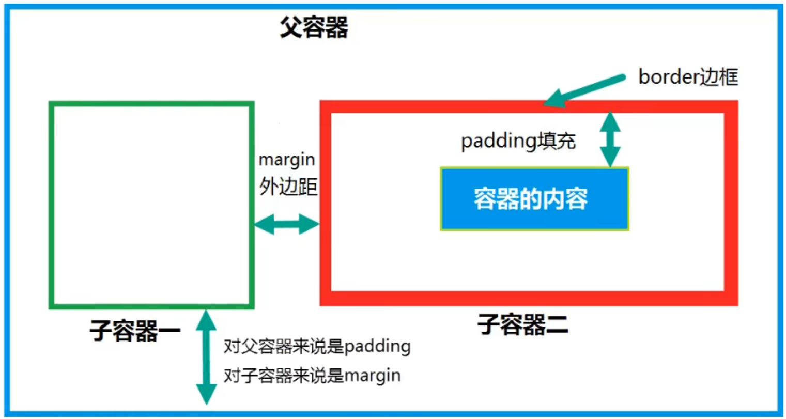

# DIV盒模型与CSS基础

## 一、CSS使用方式

- 在元素中指定style属性

  ```html
  <td style="border: solid 2px red; background-color: white; font-size:20px"></td>
  ```

  > 也称为内嵌样式，只针对对应的这个标签生效

- 在页面中嵌入style样式块

  ```html
  <style>
      td{
          background-color:#7ffd4;
          width:25%;
          text-align:center;
          font-size:30px;
      }
  </style>
  ```

  > 通常将style标签放置于head标签中，可以针对当前页面所有元素生效

- 在也缪按中引入外部css文件

  ```html
  <link rel="stylesheet" type="text/css" href="/page/css/text.css" />
  ```

  > 外部CSS文件可以针对全站的引入了这个CSS的多个页面生效，放置于head标签中

## 二、CSS选择器

- 选择器是指CSS如何与严肃及央视将以关联关系的很重要的一种手段。CSS选择器的使用，决定了CSS样式作用或哪一个元素或者哪一种元素，对于快速或精确设置元素的央视将至关重要。

### 1.标签选择器

- 使用类型选择器，可以像这种元素类型的每个实例上引用声明

  ```css
  /* 为当前页面中所有的单元格设计统一的样式 */
  td {
      background-color: #7fffd4;
      width:25%;
      text-align:center;
      font-size:30px;
  }
  ```

### 2.类选择器

- 通过设置元素的class属性定位元素，在同一个页面中，多个元素可以归属为同一个类

  ```css
  /* 类选择器，以.开头，对元素中指定class="title"的元素设计样式 */
  .title{
      color:white;
      font-size:22px;
      folat:right;
      maargin-right:10px;
  }
  ```

### 3.ID选择器

- HTML页面中的任何一个元素，即任何一个标签，都拥有ID这个属性，我们可以通过为元素设置一个唯一的ID识别符，进而利用CSS的ID选择器对其使用样式

  ```css
  /* ID选择器，以#开头，对元素中指定id="title" 的元素设计样式 */
  #title{
      color:white;
      font-size:22px;
      float:right;
      maargin-right:10px;
  }
  ```

### 4.组合选择器

- 可以将标签选择器、ID选择器、类选择器和属性选择器等组合为不同的选择器类型来构成更为负载的选择器。通过组合选择器，可以更加精确的处理希望赋予某种赋予某种表示的元素，也可以通过指定父子关系来对元素进行选择。

  ```css
  /* 组合ID、标签选择器，实现层次关系 */
  #button td{
      font-size:32px;
      font-family:微软雅黑;
      text-align:center;
  }
  ```

### 5.属性选择器

```css
/* 为DIV元素下拥有type="button"属性的元素上位机样式 */
div[type="button"]{
    color:white;
    font-size:22px;
}
```

### 6.伪类选择器

- 设计伪类和伪元素可以实现其中的一些效果。使用伪类可以根据一些情况改变文档中连接的样式，如根据链接是否被访问，合适被访问以及用户和文档的交互来应用改变。借助伪元素，可以更改元素的第一个字母和第一行的样式，或者添加源文档中没有出现过的元素。

  ```css
  /* 使用hover伪类设置鼠标划过时的效果 */
  #button td:hover{
      background-color:red;
  }
  ```

## 三、DIV盒模型

- CSS盒模型本质上是一个盒子，封装周围的HTML元素，它包括：外边距（与其他盒子之间的距离），内间距（盒子边框与内容之间的填充距离），边框，和实际内容。盒模型允许我们在其它元素和周围元素边框之间的空间放置元素。

- 内容(content)：是盒子里装的东西，可多可少，可以是任意类型
- 填充(padding)：是避免盒子里装的东西是损坏而添加的泡沫或者其他抗震辅料
- 边框(dorder)：是盒子本身，边框也有厚有薄，也可以由不同色彩
- 边界(margin)：说明盒子拜访的时候不能全部堆在一起，要留一定空隙。



> 在页面布局中，通常使用DIV+CSS进行，而table主要用于展示二维表格数据。

