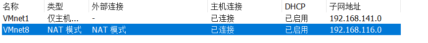
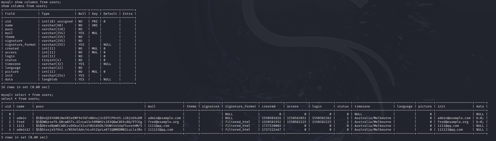

# DC-1靶场

## 扫描

- Nmap扫描配置的虚拟机子网网段

  

  

  

## 寻找攻击点

- 访问80，简单点点页面，发现请求新密码功能不可用，并且admin是存在的用户名，创建用户有后端非法字符验证，没有注入点

  

- 使用工具劫持，尝试在登录功能注入，未果。

- 访问robots.txt文件发现以下内容，但是基本没什么有用的

  | Directories | Files               | Paths (clean URLs) | Paths (no clean URLs) |
  | :---------- | :------------------ | :----------------- | :-------------------- |
  | /includes/  | /CHANGELOG.txt      | /admin/            | /?q=admin/            |
  | /misc/      | /cron.php           | /comment/reply/    | /?q=comment/reply/    |
  | /modules/   | /INSTALL.mysql.txt  | /filter/tips/      | /?q=filter/tips/      |
  | /profiles/  | /INSTALL.pgsql.txt  | /node/add/         | /?q=node/add/         |
  | /scripts/   | /INSTALL.sqlite.txt | /search/           | /?q=search/           |
  | /themes/    | /install.php        | /user/register/    | /?q=user/register/    |
  |             | /INSTALL.txt        | /user/password/    | /?q=user/password/    |
  |             | /LICENSE.txt        | /user/login/       | /?q=user/login/       |
  |             | /MAINTAINERS.txt    | /user/logout/      | /?q=user/logout/      |
  |             | /update.php         |                    |                       |
  |             | /UPGRADE.txt        |                    |                       |
  |             | /xmlrpc.php         |                    |                       |

## getshell

- 用wappalyzer看看网站架构

  

- 找一下这个CMS的漏洞，然后工具流吧

  

- 用这个远程代码执行的这个`drupalgeddon2`

  

  

  > 这里DC-1的IP变成了137.129是因为kali的网络问题，重新配置了下网络

## flag

### flag1

- 就在home目录下


### flag2

- 上一个flag提示和drupal的配置文件有关

- 网上查drupal的配置文件位置在`/sites/default/settings.php`，使用cat输出发现内容很多，先找一下文件中有没有`flag`

  

- 发现在第五行，那就输出一下第1到30行内容看看

  

- 获得flag2

### flag3

- 告诉我们要拿到flag需要通过认证，但是字典爆破是不可行的，下面有给出了数据库的账号密码，登陆看看

  

- 这个时候终端出问题了，输命令没回显，输错了直接退出来了，没法用。网上找到大佬的方法，用python创建一个模拟终端

  > [渗透入门之DC-1主机渗透详细教学 - FreeBuf网络安全行业门户](https://www.freebuf.com/defense/376418.html)

  ```python
  python -c "import pty;pty.spawn('/bin/bash')"
  
  '''
  python -c：
  python -c命令用于执行一个Python代码字符串。-c选项后面跟着的是要执行的Python代码，用双引号括起来。
  import pty：
  pty模块是Python的标准库之一，用于处理伪终端。伪终端是一种特殊的设备，它允许一个程序（如Python脚本）模拟一个终端会话。
  pty.spawn('/bin/bash')：
  pty.spawn函数会创建一个伪终端，并在其中启动指定的命令（这里是/bin/bash），然后将标准输入、输出和错误重定向到这个伪终端，从而提供一个交互式的shell环境。
  '''
  ```

  

- 根据提示，拿到flag需要登录到系统，所以查用户表，找到了账号和密码哈希，而不是密码

  

- 由于前面flag2就提到字典爆破是不可行的，试过了可以改字段值，但是也不知道人家用的是哪个算法，所以得尝试找其他方法。许多CMS都有自动更新管理员密码的脚本，网上查到在`/scripts/`目录下

  >[３Drupal文件夹结构](https://www.thinkindrupal.com/book/export/html/5330)

  

- 不过这个脚本并不是直接更改新密码然后自动写入数据库，它只是生成一个密码的正确hash，然后离谱的是，必须在/var/www目录下以`./scripts/password-hash.sh`方式执行它，要不然就报错，试了半天  (☍﹏⁰)

  

  

  


### flag4

- 根据提示，flag4与系统中passwd和shadow文件有关，没有root权限，先看看passwd内容

  

- flag4用户的密码被保存到shadow中，HOME目录为/home/flag4，cd过去，找到flag4

  

### flag5

- 提示告诉我们flag5在/root目录下，那就要拿到root权限，查系统里设置了suid权限的文件

  

- 看到`gpasswd、newgrp、passwd`，但是试过发现都没什么用，gpasswd可以改用户组，但是还是需要真的root权限。

- 重新回去理解了下flag3的提示，特殊的perm可以帮助`find`找到passwd，也就保存在shadow中的密码，但是需要使用`-exec`来获取到shadow中的内容，不过已知flag5在/root目录下，那么就没必要去找shadow里的密码hash了，也不一定能爆破出来，直接输出flag文件就行了。

  > 其实我在这里试过了爆破密码，flag4用户的密码可以很快爆破出来：orange，不过flag4也就是个普通用户，没啥用。但是root的应该是个强密码，跑了几分钟就放弃了，[字典](https://github.com/brannondorsey/naive-hashcat/releases/download/data/rockyou.txt)
  >
  > | user  | pass                                                         |
  > | ----- | ------------------------------------------------------------ |
  > | root  | \$6\$rhe3rFqk$NwHzwJ4H7abOFOM67.Avwl3j8c05rDVPqTIvWg8k3yWe99pivz/96.K7IqPlbBCmzpokVmn13ZhVyQGrQ4phd/ |
  > | flag4 | \$6\$Nk47pS8q$vTXHYXBFqOoZERNGFThbnZfi5LN0ucGZe05VMtMuIFyqYzY/eVbPNMZ7lpfRVc0BYrQ0brAhJoEzoEWCKxVW80 |

- `find /root -name '*flag*' -exec cat {} \;`
  
  - /root是find命令搜索的路径
  - -name '/\*flag\*'是查找条件
  - -exec表示对找到的文件执行后面的命令
  - {}为cat命令参数的占位符，代表当前找到的文件路径
  - ;表示-exec的结束位置，\表示转义，防止部分系统误解


- 还有一种方法，是使用find命令打开/bin/bash，但是通过测试发现简单的`find /bin/bash -exec {} \;`打开的shell终端依旧是普通用户权限，这是因为执行到/bin/bash时find的SUID权限被忽略了，实际上还是普通用户权限打开的bash，所以需要使用/bin/bash的-p选项打开一个继承了SUID权限的shell

  - /bin/bash -p参数的作用：不要清理环境变量（如 `PATH`）、保留权限提升（SUID/SGID）上下文。

  