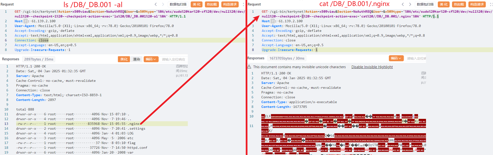

# 2024长城杯铁人三项

## zeroshell

### 题目描述

> 小路是一名实习生，接替公司前任网管的工作，一天发现公司网络出口出现了异常的通信，现需要通过回溯出口流量对异常点位(防火墙)进行定位，并确定异常的设备。然后进行深度取证检查（需要获取root权限）。现在需要你从网络攻击数据包中找出漏洞攻击的会话，分析会话编写exp或数据包重放获取防火墙设备管理员权限，查找防火墙设备上安装的木马，然后分析木马外联地址和通信密钥以及木马启动项位置。
>
> 1.从数据包中找出攻击者利用漏洞开展攻击的会话（攻击者执行了一条命令），写出该会话中设置的flag, 结果提交形式：flag{xxxxxxxxx}
>
> （本题附件见于提前下载的加密附件2e9c01da1d333cb8840968689ed3bc57.7z，解压密码为11b0526b-9cfb-4ac4-8a75-10ad9097b7ce ）
> 2.通过漏洞利用获取设备控制权限，然后查找设备上的flag文件，提取flag文件内容，结果提交形式：flag{xxxxxxxxxx}
> 3.找出受控机防火墙设备中驻留木马的外联域名或IP地址，结果提交形式：flag{xxxx}，如flag{www.abc.com} 或 flag{16.122.33.44}
> 4.请写出木马进程执行的本体文件的名称，结果提交形式：flag{xxxxx}，仅写文件名不加路径
> 5.请提取驻留的木马本体文件，通过逆向分析找出木马样本通信使用的加密密钥，结果提交形式：flag{xxxx}
> 6.请写出驻留木马的启动项，注意写出启动文件的完整路径。结果提交形式：flag{xxxx}，如flag{/a/b/c}

### zeroshell_1

- 查看所有的HTTP对象

  

- 发现一条命令执行的请求

  

- 查询frame.number == 11053找到数据包，然后追踪流

  

- 发现请求报文中Referer字段值开头为flag的base64编码，用cyberchef解码

  

- flag{6C2E38DA-D8E4-8D84-4A4F-E2ABD07A1F3A}

### zeroshell_2

- 重放攻击者执行ps -ef命令的数据包，成功执行

  

- 修改命令为`find / -name flag`查找系统中flag文件

  

- `cat `

  

- flag{c6045425-6e6e-41d0-be09-95682a4f65c4}

### zeroshell_3

- 不知道为什么`netstat -ano`查出来没有显示那个SYN_SENT的异常IP

  

- 那就看看第二题flag同目录下的所有文件，发现.nginx，cat一下，然后保存报文body

  

- 用正则表达式找一下IP地址

  

- flag{202.115.89.103}

### zeroshell_4

- 就是上面找到的.nginx文件
- flag{.nginx}

### zeroshell_5

- 靠猜的，反编译查字符串，和外联IP最近的看着像

  

## WinFT

### 题目描述

>某单位网管日常巡检中发现某员工电脑（IP：192.168.116.123）存在异常外连及数据传输行为，随后立即对该电脑进行断网处理，并启动网络安全应急预案进行排查。
>
>1、受控机木马的回连域名及ip及端口是（示例：flag{xxx.com:127.0.0.1:2333}）
>
>（本题附件见于提前下载的加密附件82f13fdc9f7078ba29c4a6dcc65d8859.7z，解压密码为3604e2f3-585a-4972-a867-3a9cc8d34c1d ）
>2、受控机启动项中隐藏flag是
>3、受控机中驻留的flag是
>4、受控源头隐藏的flag是
>5、分析流量，获得压缩包中得到答案
>6、通过aes解密得到的flag

### winFT_1

- netstat -ant 然后查dns缓存

  

- flag{miscsecure.com:192.168.116.130:443}

### winFT_2

- 查看任务计划程序

  

- base64解码后html实体解码

  

- flag{AES_encryption_algorithm_is_an_excellent_encryption_algorithm}

### winFT_3/4

- 没看明白，网上的wp也没有这两个题的解

### winFT_5

- 先看看导出的http对象

  

- 已知192.168.116.130是木马回连地址，那这两个client和server就是木马的客户端和服务端。是二进制文件，而且有50 2b 03 04开头和50 2b 05 06的zip标志，猜测这两个可以合成一个zip

  

- `copy /b client+server flag.zip`合成两星

  

  > 右侧有备注文本，也解释了为什么50 2b 05 06不是文件的二进制结尾

- 备注试过了，不是密码，随便解码看看

  

- `时间线关联非常重要`是解压密码，得到flag.txt内容

- flag{a1b2c3d4e5f67890abcdef1234567890-2f4d90a1b7c8e2349d3f56e0a9b01b8a-CBC}

### winFT_6

- 根据2，5的flag内容，猜测上面flag里那串字符是cbc模式aes加密的结果
- 至于密钥？或许在捕获的流量里？我不知道  ╮（╯＿╰）╭

## SC_05

### 题目描述

> 近日某公司网络管理员老张在对安全设备进行日常巡检过程中发现防火墙设备日志中产生了1条高危告警，告警IP为134.6.4.12（简称IP1），在监测到可疑网络活动后，老张立刻对磁盘和内存制做了镜像。为考校自己刚收的第一个徒弟李华，老张循序渐进，布置了5道问题。假如你是李华，请你根据提供的防火墙日志、磁盘镜像及内存镜像文件对主机开展网络安全检查分析，并根据5道问题提示，计算并提交相应flag。
>
> 问题1：IP1地址首次被请求时间是多久？计算内容如：2020/05/18_19:35:10 提交格式：flag{32位大写MD5值}
>
> （本题附件见于提前下载的加密附件38c44f100028b56e09dc48522385fa95.7z，解压密码为 37af3744-53eb-49fd-854a-f6f79bbf5b1c ）
> 问题2：IP1地址对应的小马程序MD5是多少？提交格式：flag{32位大写MD5值}
> 问题3：大马程序运行在哪个进程中？计算内容：PID-进程名，如123-cmd.exe 提交格式：flag{32位大写MD5值}
> 问题4：大马程序备用回连的域名是多少？计算内容如：www.baidu.com 提交格式：flag{32位大写MD5值}
> 问题5：攻击者最终窃取数据的文件中包含的flag值？ 提交格式：flag{xxx},注意大小FLAG{xx}要转换为小写flag{xx}

### sc_05_1

- 对firewall.xlsx文件的三个表筛选，找时间最早的计算md5，即2024/11/09_16:22:42

- flag{01DF5BC2388E287D4CC8F11EA4D31929}
