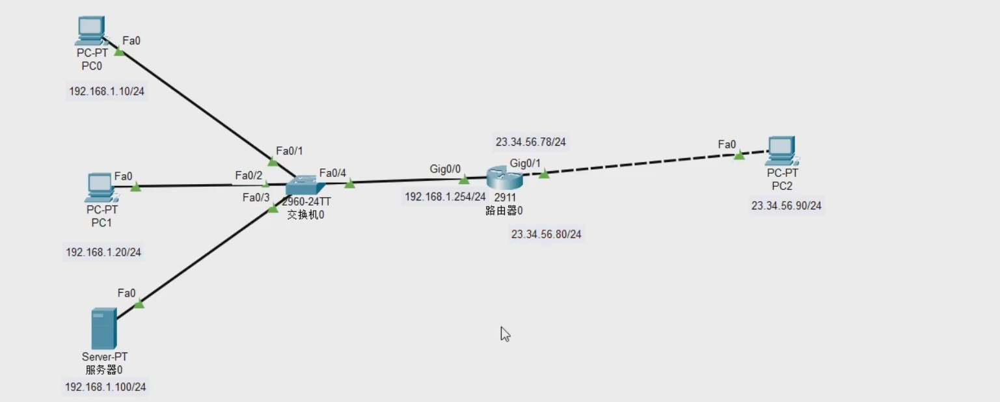

# 网络地址转换NAT

## 一、NAT基本概念

- 在IPV4的环境中，由于网络分为私网公网，私网落、的地址无法在公网上进行路由

### 1. 目的

- 将私网地址转换为公网地址

### 2. 出现背景

- IP地址不够用

### 3. 转换方式

- 静态转换 --仅进行IP地址转换  1对1转
- 动态转换 --仅进行IP地址转换  多对多转  内网的一部分转换为外网的一部分
  - 内网地址多于外网地址		5--3
  - 外网地址多于内网地址		
- 口多路复用PAT --多对一转		携带端口一起转换
  - 192.168.1.1：8899---->64.23.54.99：6677
  - 192.168.2.1：2277---->64.23.54.99:8866
- 端口映射（服务器映射）
  -  将一台内网的服务器发送到外网，从外网的主机可以访问到外网的服务器
  -  192.168.1.1：80---->64.23.54.99：80
  -  目的地址转换

## 二、转换表中的4类地址

- 内部局部地址：发送方的内网
- 内部全局地址：发送方的外网
- 外部局部地址：接收方的内网
- 外部全局地址：接收方的外网

## 三、静态转换配置

- 固定 1对1转
- 命令


```shell
int g0/0
ip nat inside/outside
#指定为内网接口/外网接口
```

```shell
ip nat inside source static 192.168.10.10 23.34.56.100
#添加静态转换条目，需要首先去定义出口路由器内网接口和外网接口
```

```shell
show ip nat translations
#查看转换表
```

## 四、动态转换配置

- 动态的 多对多转换

```shell
#先定义内网范围，定义一个访问控制列表
access-list 1 permit 192.168.10.0 0.0.0.255
#定义一个外网范围，使用名称指定范围IP
ip nat pool woniu 23.34.56.70 23.34.56.71 netmask 255.255.255.0
#应用
ip nat inside source list 1 pool woniu
```

```shell
clear ip nat transiation *
#清除所有转换表
```

## 五、PAT



### 1. 端口多路复用（多对一）

- 主要是将内网的多个地址转换为外网的一的IP地址（将端口一起转换，从而进行区分）

  - 配置

    ```shell
    #定义内网范围
    access-list 1 permit any
    #定义外网范围（外网只有一个IP地址，多以其实和结束都是这一个IP）
    ip nat pool woniu 23.34.56.80 23.34.56.80 netmask 255.255.255.0
    #应用（因为使用的是PAT，后面需要加上overload）
    ip nat inside sourcelist 1 pool woniu overload
    ```

- 将内网的多个地址直接转换为外网接口的地址

  - 配置

    ```shell
    #定义内网范围
    access-list 1 permit any
    #应用（因为使用的是PAT，后面需要加上overload）这里直接引用的的外网接口
    ip nat inside sourcelist 1 int g0/1 overload
    ```

- 是目前企业中最常使用的方式（源地址转换，NAT代理上网）

### 2. 端口映射（服务器映射）

- 主要是将内网的某一台服务器（服务器上就会有对应的服务）映射到外网的每一个IP地址的某个端口

  - 配置

    ```
    ip nat inside source static tcp 192.168.1.100 80 23.34.56.78 80
    ```

- 因为内网的端口标识了服务器的服务类型，所以不能更改

- 映射出去的外网端口可以更改，但是会影响外网客户端访问时的端口号，如果映射的外网端口为8088端口，这是外网客户机在访问内网服务器时，访问的是映射出去的IP地址及端口号（8088）（http://23.34.45.78:8088)

- 是目前企业中针对内网服务器对外提供服务时使用（目的地址转换）

## 六、总结

- 静态转换	
  - 1对1转换	1个内网地址转换为一个外网地址，形成的是永久性的对应关系，可以更具外网地址直接定位到内网地址，可以实现内网访问外网，也可以实现外网访问内网
- 动态转换
  - 多对多转换	内网多个IP转换为外网多个IP，当内网主机数量多于外网IP地址个数时，无法实现内网所有主机同时上网，由于是动态的对应关系，所以无法根据外网地址锁定到内网地址，只能实现内网访问外网
- 端口多路复用（PAT）
  - 多对一转换（源地址转换，NAT代理上网）	内网多个IP地址转换为外网一个IP地址（外网接口IP地址），使用不同端口号进行区分，形成的也是动态的对应关系，只能实现内网访问外网
- 端口映射（服务器映射、目的地址转换）
  - 主要是将内网的某一台服务器（服务器上就会有对应的服务）映射到外网的每一个IP地址的某个端口
  - 形成的是永久性的对应关系，但是只能实现外网访问内网


