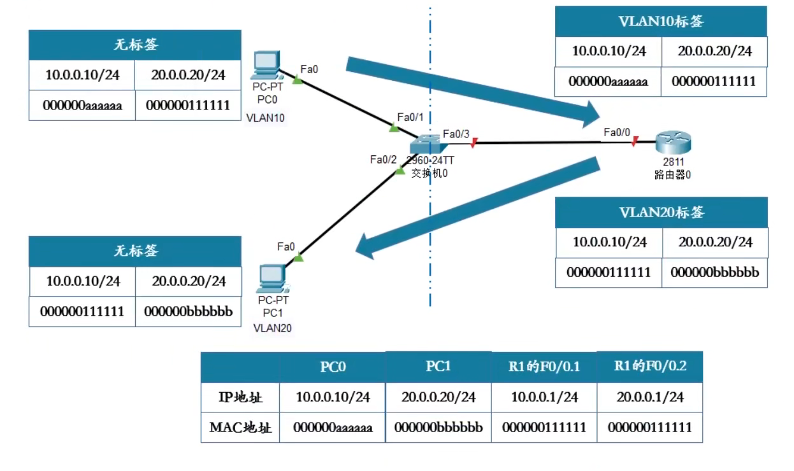
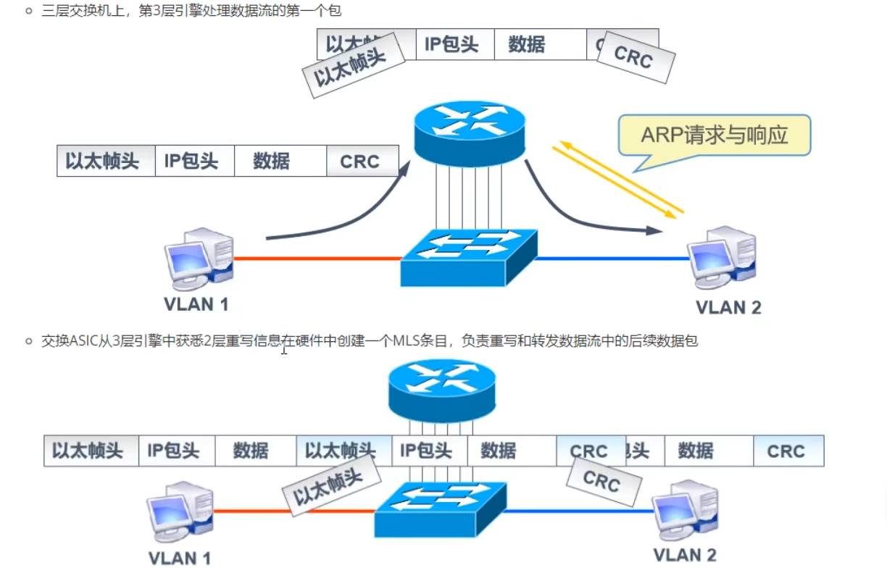
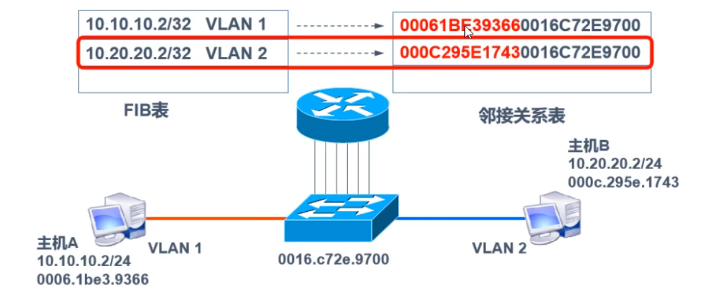
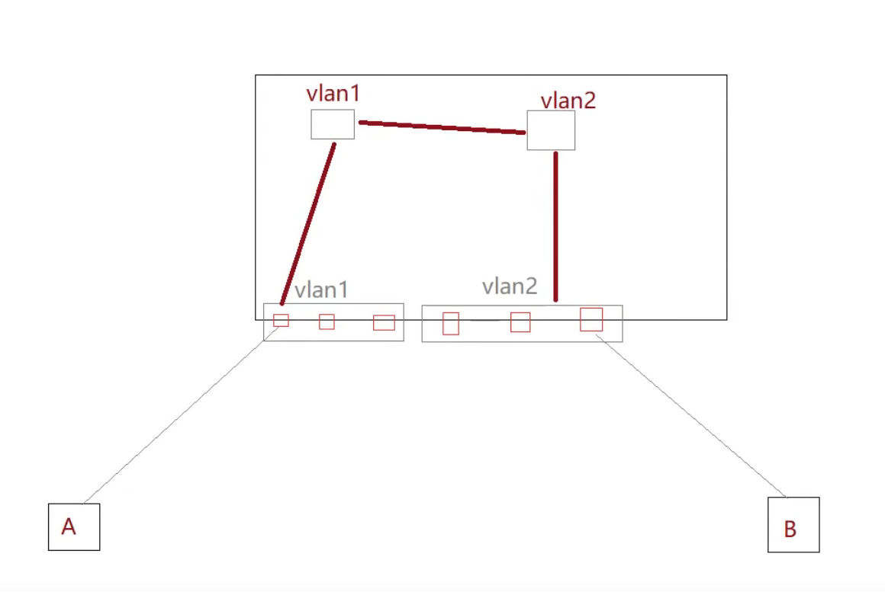
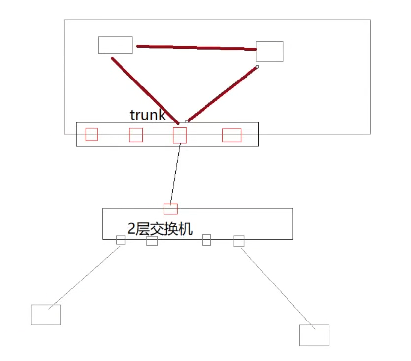

# 前言

在同一交换机上划分vlan，从而相同vlan主机可以通信，不同vlan不能通信

不同vlan，是属于不同广播域，配置的是不同的网段ip，针对不同网段IP进行通信需要借助路由

可以实现不同vlan间的通信技术：单臂路由、三层交换

# 单臂路由

- 在路由器上划分不同vlan的网关，每一个接口作为一个网关，需要做vlan封装
- 交换机与主机链接的链路：access
- 交换机与路由器链接的链路：trunk

工作原理

上图为例，PC0需要发送数据给PC1，发现PC1和自己不是同一网段，这时将数据交给自己的网关，网关为路由器0的F0/0.1子接口，通过ARP协议获取自己网关的MAC地址，数据会通过交换机进行转发，到了交换机之后，会为收到的数据打上valn10标签，将数据传到路由器0，路由器0收到数据，集合路由器工作原理，查看目的IP地址，找到对应接口，在进行标签转换，再转发到交换机，这时交换机收到的就是打上vlan20标签数据，根据交换的MAC地址表的对应关系直接转发

# 三层交换

## 一、目的

- 通过在交换机上划分vlan，想要实现不同vlan间的通信，这时就乐意使用三层交换来解决
- 使用单臂路由可以解决不同vlan间的通信，为什么还要使用三层交换来解决？
  - 单臂路由容易造成网络瓶颈，子接口依托于物理接口，当vlan过多，物理接口压力过大
  - 单臂路由著有利用路由器的转发每一次数据来了都需要进行路由，路由器工作量较大

## 二、基本概念

- 三层交换技术：二层交换技术+三层转发技术

## 三、传统三层交换

- 工作原理：

  

- 一次路由，多次交换

## 四、基于CEF的三层交换（MLS）

- 基于路由表直接生成邻接关系表，直接进行硬件转发

- 维护了两张表

  - 路由表（转发信息库FIB）
  - 邻接关系表（MAC地址信息）

- 工作原理：

  1.主机A给B发送单播数据包

  2.交换机查找FIB表，找到下一跳地址

  3.查找下一跳地址对应的邻接关系的2层封装信息

  4.转发

  

### 1. 引入虚接口

