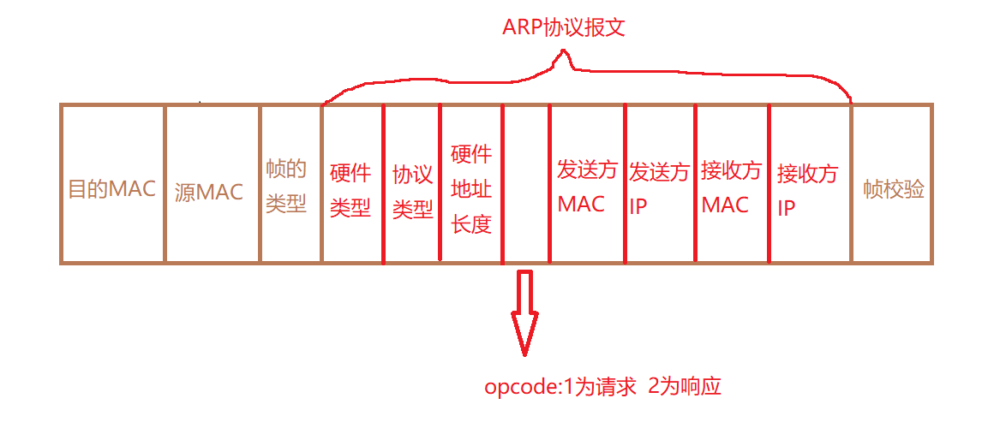

# ARP协议（地址解析协议）

## 一、ARP协议

- 将一个已知的IP地址解析为MAC地址，从而进行二层数据交互

- 是一个三层协议但工作在二层，是一个2.5层协议

## 二、工作流程

### 1. 两个阶段

- ARP 请求：广播方式
- ARP响应：单播方式

### 2. ARP协议报文（分组）格式

### 3. ARP缓存

- 主要的目的是为了避免重复发送ARP请求
- 在Windows操作系统中使用ARP命令
  - arp -a:查看ARP缓存表
  - arp -d：清除ARP缓存
- 在思科设备上使用ARP命令
  - show arp:查看ARP缓存表
  - clear arp:清除ARP缓存表
  - arp IP地址 MAC地址 arpa:静态添加ARP条目

## 三、ARP攻击及ARP欺骗

### 1. ARP攻击

- 伪造ARP应答报文，向被攻击主机响应虚假的MAC地址
- 当被攻击主机进行网络通信时，会将数据交给虚假的MAC地址进行转发，由于虚假的MAC地址不存在，座椅造成被攻击主机无法访问网络

### 2. ARP欺骗

- 欺骗网关
  - 伪造ARP应答报文，向被攻击主机和网关响应真实的MAC地址
  - 当被攻击主机进行网络通信时，会将数据交给真实MAC地址进行转发，从而截获被攻击主机的数据，这时被攻击主机是可以进行网络通信的
- 欺骗主机
  - 伪造ARP应答报文，向被攻击主机和通信主机响应真实的MAC地址
  - 当被攻击主机向通信主机发送数据时，会将数据交给真实MAC地址进行转发，从而截获被攻击主机的数据，这时被攻击主机是可以进行网络通信的

## 四、实施ARP欺骗和攻击

### 1. 环境

- kali linux
  - 安装arpspoot
- win 10
  - 被攻击主机

### 2、kali配置

kali linux系统是基于debian linux系统，采用deb包管理方式，可以使用apt源的方式进行直接从源安装

- 配置源
- 安装工具
  - dsniff工具