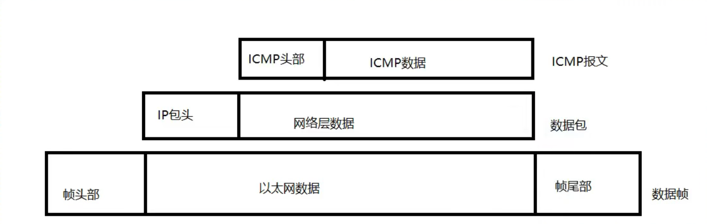

# ICMP协议

## 一、ICMP基本概念

### 1. ICMP协议

- Internet控制报文协议，用于在IP主机、路由器之间传递控制消息，控制消息指网络通不通、主机是否可达、路由器是否可用

- ICMP是属于网络层的协议，封装在传输层和网络层之间

  

### 2. ICMP报文格式

类型(type)

代码(code)

- 类型(0~18)
  - (8   0)   请求
  - (0   0)    回显应答（表示比较正常的应答）
  - (3   1)    目标不可达（主机不可达）
  - (11   0)    超时（传输期间生存时间为0）
  - (3   3)    目标不可达（端口不可达）
  - (3   2)    协议不可达
  - 类型13、14    时间戳请求和应答
  - (5   0)    重定向（网络重定向）
  - (5   1)    主机重定向

## 二、ICMP重定向

在某些特定情况下，路由器检测到主机使用非优化路由时候，回向主机发送一个ICMP重定向报文，使主机的路由改变

## 三、ICMP重定向攻击

- 安装netwox
- [netwox官网](https://web.ecs.syr.edu/~wedu/Teaching/cis758/netw522/netwox-doc_html/tools/index.html)

