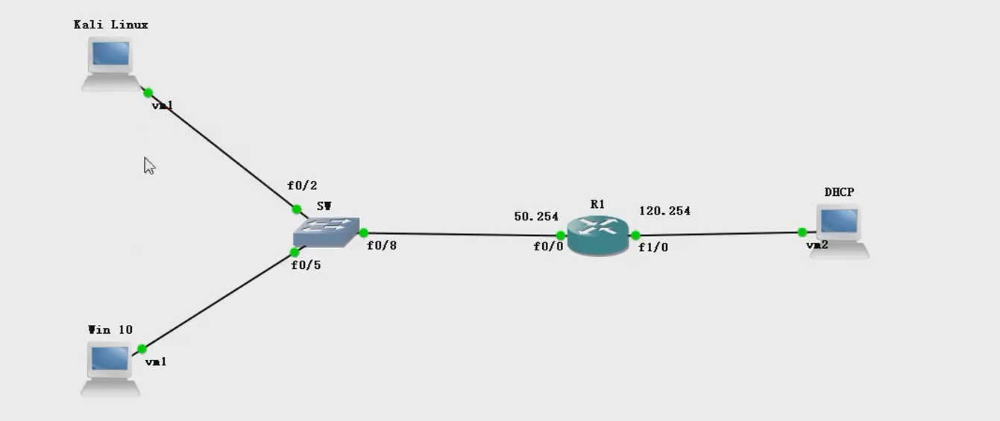

# DHCP协议

## 一、DHCP

### 1. DHCP基本概念

- DHCP：动态主机配置协议
- 主要给客户机提供TCP/IP参数（IP地址、子网掩码、网关、DNS等）

### 2. 使用DHCP的好处

- 减少管理员的工作量
- 避免输入错误
- 避免IP冲突
- 提高IP地址的利用率

### 3. DHCP工作原理

- 它是应用层协议，基于UDP，主机向服务器67号端口发送请求，服务器响应给客户机的68号端口

- 客户机与服务器的交互过程

  - 客户机以广播方式发送dhcp discover
  - 网络中所有的DHCP服务器都会收到，都会响应，客户机会向第一个收到的offer报文的服务器发送dhcp request
  - 服务器服务器确认，客户机获得TCP/IP参数

  

### 4. DHCP的8种报文

- dhcp discover
- dhcp offer
- dhcp request
- dhcp ack
- dhcp release：释放IP
- dhcp nak:针对request的拒绝响应报文
- dhcp decline:当客户端发现服务器分配给它的IP地址发生冲突时会通过发送此保温来统治服务器，并且会重新向服务器申请IP
- dhcp intorm

### 5. DHCP的报文格式

- message type：消息类型（1表示请求，2表示响应
- hardware type：硬件类型
- hardware address length：硬件地址长度
- hops：DHCP报文经过的DHCP中继的数目
- transaction id：事务id（是一个随机数）
- bootp flags：保留的标识字段
- client ip address：客户机的IP
- your(client) ip address：服务器可以提供给客户机的IP
- next server IP address：DHCP服务器地址
- relay agent ip address：中继代理的IP
- client mac address：客户端的mac地址
- client hardware address padding：客户端mac地址的填充（一般为20位的二进制0填充）

## 三、实施DHCP欺骗



- 先在路由器R1上配置DHCP中继

```
ip helper-adderss 192.168.120.100
192.168.120.100:DHCP服务器IP
```

- 在kali上安装yersinia

  ```
  yersinia -G
  使用图形化界面
  ```

## 四、DHCP防御


### 1. 在交换机上配置信任接口

- 开启DHCP监听

  ```
  ip shcp snooping
  ```

- 指定监听vlan

  ```
  ip shcp snooping vlan 1
  ```

- 由于开启监听后，交换机上的接口就会全部变成非信任端口（会拒绝DHCP报文），所以需要将正常的接口添加为信任端口

  ```
  int f0/1
  ip dhcp snooping trust
  ```

- 启用核实mac地址

  - 检测非信任端口的请求报文中源MAC地址和DHCP请求报文中的客户端MAC地址是否相同

  ```
  ip shcp snooping cerify mac-address
  ```

- 查看绑定表

  ```
  ip dhcp snooping binding
  ```

- 百度百科解释：

  **DHCP Snooping**是 [DHCP](https://baike.baidu.com/item/DHCP) 的一种安全特性，主要应用在 [交换机](https://baike.baidu.com/item/交换机) 上，作用是屏蔽接入网络中的非法的 [DHCP](https://baike.baidu.com/item/DHCP) 服务器。即开启 DHCP Snooping 功能后，网络中的客户端只有从管理员指定的 [DHCP](https://baike.baidu.com/item/DHCP) 服务器获取 [IP](https://baike.baidu.com/item/IP) 地址。由于 [DHCP](https://baike.baidu.com/item/DHCP) 报文缺少认证机制，如果网络中存在非法 [DHCP](https://baike.baidu.com/item/DHCP) 服务器，管理员将无法保证客户端从管理员指定的 [DHCP](https://baike.baidu.com/item/DHCP)服务器获取合法地址，客户机有可能从非法 [DHCP](https://baike.baidu.com/item/DHCP) 服务器获得错误的 [IP](https://baike.baidu.com/item/IP) 地址等配置信息，导致客户端无法正常使用网络。

  启用 DHCP Snooping 功能后，必须将 [交换机](https://baike.baidu.com/item/交换机)上的端口设置为信任(Trust)和非信任(Untrust)状态，[交换机](https://baike.baidu.com/item/交换机) 只转发信任端口的 DHCP OFFER/ACK/NAK报文，丢弃非信任端口的 DHCP OFFER/ACK/NAK 报文，从而达到阻断非法 [DHCP](https://baike.baidu.com/item/DHCP) 服务器的目的。建议将连接 [DHCP](https://baike.baidu.com/item/DHCP) 服务器的端口设置为信任端口，其他端口设置为非信任端口。

### 2. 其他

- 启用“选项82”

  ```
  ip dhcp dnoopping information option
  ```

- 限制DHCP报文速率*

  ```
  ip dhcp snooping limit rate 100q
  ```
