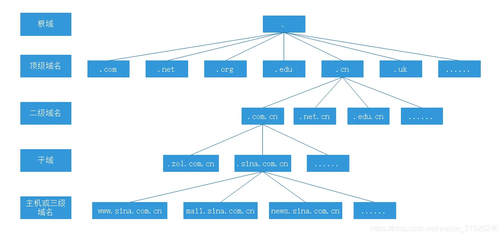

# DNS协议

## 一、DNS

### 1. 概念

- DNS（domain name system)域名系统，作为将域名的IP地址相互映射关系存放在一个分布式的数据库，DNS使用的是UDP的53端口
- 域名：有ICANN机构统一管理

### 2. 域名空间

- 树状结构

  

  - 根域：（全世界只有13台根域服务器）

  - 顶级域：（主要用于区分域名的用途）

    - 组织类：商业（com）		教育和学校（edu）			社会非盈利性组织（org）
    - 国家/地区域名：中国（cn)  			香港（hk）  		   美国(us)    		英国(uk)

  - 二级域名

  - FQDN：完全限定域名 

    

## 二、DNS查询


### 1. 查询过程

- 客户机想要访问www.baidu.com，根据自己的TCP/IP参数，向自己的首选DNS服务器发送DNS请求
- 首选DNS收到客户机的请求后，会去查询自己的区域文件，找不到www.baidu.com的IP地址信息（将请求转发到根域服务器，需要配置根提示）；直接可以以找到www.baidu.com的IP地址信息（直接响应给客户机）
- 根域服务器收到请求后，由于根域服务器只维护顶级服务器信息，会响应顶级域服务器IP，首选DNS根据根域服务器响应的信息，将请求转发到com顶级域
- com顶级域服务器收到请求，由于com顶级域服务器只维护二级域信息，二级服务器IP（baidu.com),首选DNS根据顶级域相应的信息，将请求转发到baidu.com二级域
- baidu.com二级域收到请求，baidu.comDNS服务器里面维护的是baidu.com区域的所有主机信息，包含了www.baidu.com的信息，直接将www.baidu.com的IP地址响应给首选DNS
- 首选DNS在响应给客户机

### 2. 递归查询

- 当客户机请求自己的首选DNS服务器，首选DNS服务器上有域名记录信息，直接响应给客户机（由上图所示，第一步和第八步是递归）

### 3. 迭代查询

- 首选DNS服务器没有域名记录信息，通过一步一步去根域服务器，顶级域服务器，二级域服务器，最终找到对应的域名记录信息

### 4. 查询内容

- 正向：通过域名查IP
- 反向：通过IP查域名

## 三、使用Windows部署DNS服务器

-  使用Linux配置时使用bind服务

### 1. DNS服务器分类

- 主要名称服务器：存放区域（二级区域）中相关的设置，存放的是区域文件的正本数据
- 辅助名称服务器：存放的是副本数据，是从主要名称服务器复制过来的，不能修改
- 主控名称服务器：提供数据复制（可以理解为DNS服务器中某一个角色）
- 缓存（cache-only）域名服务器：里面没有区域文件，需要配置转发器

### 2. 配置

- 在server上安装DNS服务器
- 新建正向查找区域
  - SOA记录
  - NS记录
- 新建主机（A）记录
- 新建别名（CNAME）记录

### 3. DNS记录

- A:主机记录，域名和IP地址的映射
- CNAME：别名记录
- SOA：权威名称服务器
- NS：名称服务器
- MX：邮件交换记录，一般有邮件服务器时使用
- SRV：正在提供特定服务的服务器
- PTR：反向指针记录

### 4. 区域传送

- 将主要名称服务武器的区域文件传送到辅助名称服务器上
- 区域传送使用的TCP协议

## 四、分析DNS流量

### 1. DNS报文字段

- ID字段
- flags:标志*
  - 第1位：标识消息类型（0是请求，1是响应）
  - 第2~5位：opcode查询种类
  - 第6位：标识是否是一个权威应答
  - 第7位：一个UDP报文为512字节，指示是否截断超过部分
  - 第8位：是否请求递归
  - 第9位：允许递归的标识
  - 第10~12位：保留位
  - 第13~16：应答码（0没有错误，1格式错误，2服务器错误，3名字错误，4服务器不支持，5拒绝，6~15保留）
- questions：请求段中问题记录数
- answer rrs：回答段中的记录数
- authority rrs：授权段中授权记录数
- additional rrs：附加段中的附加记录数

## 五、实施DNS欺骗

- 在kali上使用ettercap

- 编辑ettercap文件

  ```
  vim /etc/ettercap/etter.dns
  ```

- 先对目标主机和网关进行ARP欺骗

- 实施DNS欺骗


