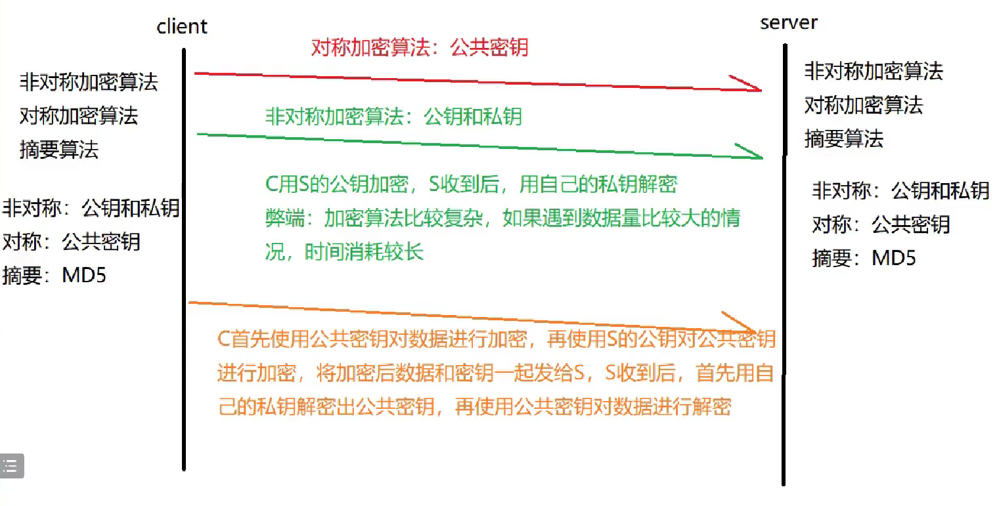
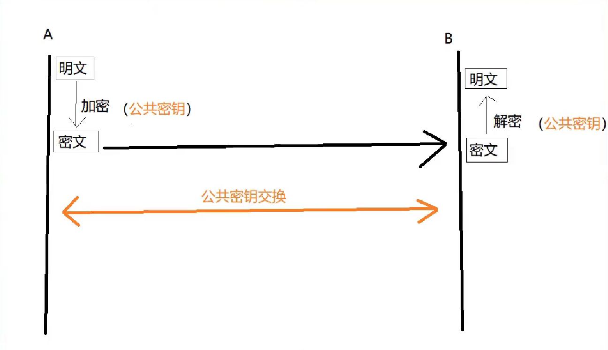
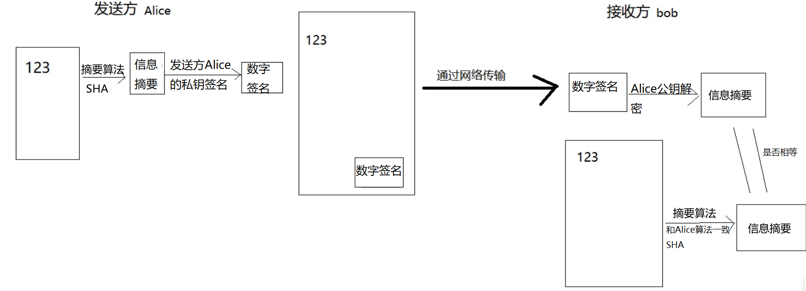
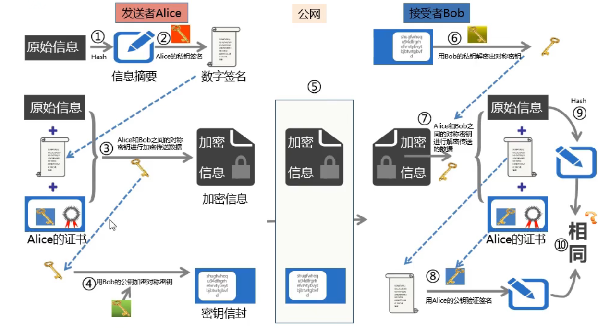

# HTTPS协议

https=http+ssl/tls

##　一、加密算法

- 在HTTP的通道上增加了安全性，传输过程中通过加密和身份认证来确保传输安全性

### 1. TLS

- 传输层安全协议，SSL和TLS其实时一个协议，SSL2.0版本，自SSL3.0版本后，更名为TLS1.0，目前最高版本TLS1.3，使用最广泛的是TLS 1.2版本
- 实际目标
  - 保密性：所有的信息都加密传输
  - 完整性：校验机制
  - 认证：双方都配备证书，防止冒充
  - 互操作、通用性
  - 可扩展
  - 高效率
- 发展史
  - SSL2.0	SSL3.0	TLS1.1	TLS1.2	TLS1.3

### 2. HTTP的缺陷

- 明文传输
- 只对传输数据的长度进行完整性校验，数据是否被篡改不做确认

### 3. HTTPS好处

- 在传输数据之前，客户端会和服务器端协商在传输过程中的加密算法，包含自己的非对称加密的密钥交换算法（RSA/DH），数据签名摘要算法（MD5/SHA），加密的传输数据的对称加密算法（DRS/3DES/AES）
- 客户端生成随机的字符串，通过协商好的非对称加密算法，使用服务端的公钥对该字符串进行加密，发送给服务器。服务端接收到之后，使用自己的私钥解密得到该字符串。在随后的数据传输中，使用这个字符串作为密钥进行对称加密

### 4. 加密算法

- 对称加密算法（只有一个密钥：公共密钥，发送方和接收方都需要使用）

  

  - 加密和解密密钥相同
  - 密钥安全传输问题
  - 密钥多，难管理
  - 常见的对称加密算法

    - DES/3DES
    - AES
    - RC
    - IDEA

- 非对称加密算法
  - 加密和解密使用的是不同得密钥（公钥（公共密钥）和私钥，每个用户都可以有自己的公钥和私钥，公钥是公开的，四幺十由自己保存，只要一个密钥加密就必须使用另一个密钥解密）
  - 缺点：加密算法比较复杂，对于大规模数据进行加密会很慢
  - 常见的算法
    - Elgamal：基于DH密钥交换算法
    - RSA
    - ECC
    - Rabin

## 二、PKI体系（公钥基础设施）

### 1. 基本概念

- 通过使用公钥技术（非对称加密算法）和数字签名来确保信息安全
- 公钥加密技术（非对称加密算法、数字证书、CA*（证书颁发机构）*、RA*（证书注册机构）*组成）
- 实现的功能
  - 身份验证
  - 数据完整性
  - 数据机密性
  - 操作不可否认性

### 2. 身份认证及完整性校验

- 发送方Alice首先将原始数据通过摘要算法（SHA）算出信息摘要，并且用自己的私钥进行签名得到数字签名，将数字签名和原始数据发送给接收方bob
- 接收方bob收到Alice发来的原始数据和数字签名后，将原始数据通过相同的摘要算法（SHA）得到信息摘要，再使用Alice的公钥将数字签名揭开得出Alice的信息摘要（这里就完成了Alice的身份认证），比对两个摘要是否一致，如果一致，说明数据在传输过程中没有被修改

## 三、证书

### 1. 数字证书

- 保证密钥的合法性
- 证书的主体可以是用户、计算机、服务等
- 证书包含的信息
  - 使用的公钥
  - 使用的标识
  - 有效期
  - 颁发者的标识信息
  - 颁发者的数字签名

### 2. 数据安全的传输案例

### 3. 数字证书颁发机构

- CA主要是进行颁发和管理数字证书

## 四、证书服务器和HTTPS服务器

### 1. 部署证书服务器

- Windows	active directory证书服务：基于域，这里用独立
- Linux	open ssl

## 五、分析HTTPS流量

- 分析TLS交互过程

| 握手消息                                  | 动作描述                                                     |
| ----------------------------------------- | ------------------------------------------------------------ |
| 1. Client —> ClientHello —> Server        | 客户端(浏览器)发送一个hello消息给服务端，发起建立SSL会话的请求。并告诉服务端，自己支持哪些加密算法(Cipher Suite List)。除此之外，还需要产生一个随机数（第一个随机数，用于以后生成对称密钥），发送给服务端。 |
| 2. Server —> ServerHello —> Client        | 服务端的首次响应，会确定加密协议版本，以及加密的算法，也会生成一个随机数（第二个随机数）给客户端。 |
| 3. Server —> Certificate —> Client        | 服务端还会把自己的证书发送给客户端，让客户端进行校验。服务端证书中的公钥也可被用于加密后面握手过程中生成的对称密钥。 |
| 4. Server --> ServerKeyExchange —> Client | 指定使用哪种密钥协商协议。服务端**可以**在ServerKeyExchange之后立即发送CertificateRequest消息，要求校验客户端的证书。 |
| 5. Server —> ServerHelloDone —> Client    | 服务器发送ServerHelloDone消息，告知客户端服务器这边握手相关的消息发送完毕。 |
| 6. Client —> ClientKeyExchange —> Server  | 消息中包含客户端这边的EC Diffie-Hellman算法*（密钥交换算法）*相关参数，然后服务器和客户端都可根据接收到的对方参数和自身参数运算出对称密钥。 |
| 7. Client —> ChangeCipherSpec —> Server   | ChangeCipherSpec消息，通知服务器此消息以后客户端会以加密方式发送数据。 |
| 8. Client —> Finished —> Server           | 客户端计算生成对称密钥，然后使用该对称密钥加密之前所有收发握手消息的Hash值，发送给服务器，服务器将以相同的会话密钥（使用相同方法生成）解密此消息，校验其中的Hash值。 |
| 9. Server —> ChangeCipherSpec —> Client   | ChangeCipherSpec消息，通知客户端此消息以后服务器会以加密方式发送数据。 |
| 10. Server — > Finished —> Client         | 服务器使用对称密钥加密（生成方式与客户端相同）之前所发送的所有握手消息的hash值，发送给客户端去校验。 |
| 11. Application Data                      | 真正的数据传输（使用对称加密）                               |
