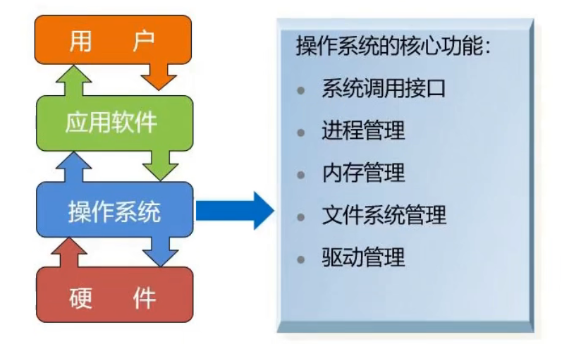
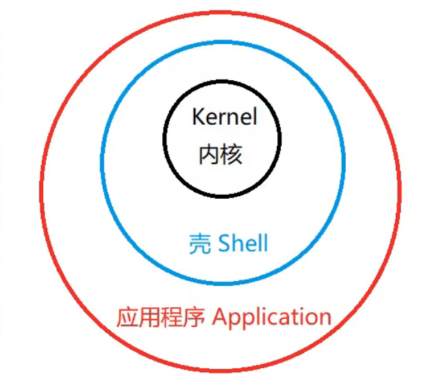
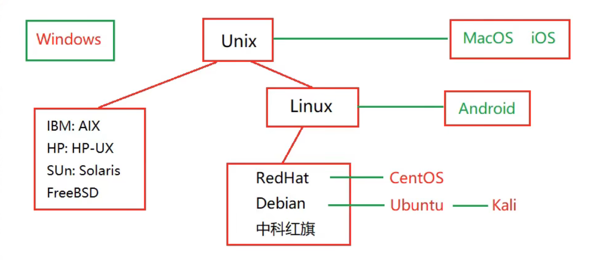

# Linux操作系统介绍

## 一、操作系统的作用

### 1. 五大基本功能

- 进程和线程管理：进程线程的状态、控制、同步互斥、通信调度等
- 存储管理：分配/回收、地址转换、存储白虎等
- 文件管理：文件目录、文件操作、磁盘空间、文件存取控制
- 设备管理：设备驱动、分配回收、缓存技术等
- 用户接口：系统命令、编程接口

### 2. 三个作用

- 资源的管理者

- 向用户提供各种服务

- 对硬件机器的扩展

  

### 3. 操作系统结构

### 4. 操作系统的应用场景

- 嵌入式设备：如POS机、单反相机、游戏机、智能设备等
- 移动端设备：手机、平板电脑等
- 个人桌面电脑：如上网本、游戏本、笔记本电脑、台式机等
- 服务器：如云服务器、PC服务器、小型机等
- 超级计算机

## 二、Linux发行版

## 四、Linux应用场景

### 1. 服务器操作系统

### 2. 移动端智能操作系统

### 3. 云大物智移机智能制造

- Linux操作系统及其定制版本和衍生版本，广泛应用于云计算、大数据、物联网、人工智能、移动互联网及互联网工业制造领域，无处不在。

