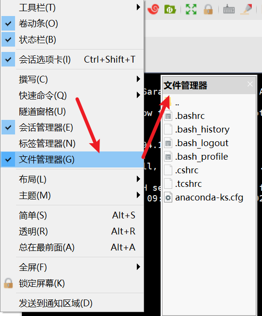

# 使用Xshell

## 一、SSH协议介绍

- Windows 和Linux实现远程通信所使用的协议是SSH
- 目前主流工具由Xshell，XFTP，SecureCRT,SecureFX等，以及免费的国产作品堡塔。
- 在手机端可以安装JuiceSSH实现与Linux远程通信。
- SSH提供两种级别的安全验证

### 1. 第一种级别（基于口令的安全验证）

- 只要知道账号和口令，就可以登录到远程主机，所有传输的数据都会被加密，但是不能保证正在连接的服务器就是你相连接的服务器。可能会有别的服务器在冒充真正的服务器，也就是受到“中间人”攻击

### 2. 第二种级别（基于密钥的安全验证）

- 需要依靠密钥也就是你必须为自己创建一对密钥，并把公用密钥放在需要访问的服务器上。如果你要连接到SSH服务器上，客户端软件就会向服务器发送请求，请求用你的密钥进行安全验证。服务器收到请求后，先在该服务器上你的主目录下寻找你的公用密钥，然后把它和你发送过来的公用密钥进行对比，如果两个密钥一致，服务器就会用公用密钥加密“质询”并把它发送给客户端软件。客户端软件收到“质询”后就可以用你的私钥解密再把它发送到服务器。
- 这种方式你必须知道自己的密钥的口令。但是，与第一种级别相比，第二种级别不需要在网络上传送口令，相对来说更安全。

## 二、Xshell使用

- 建立连接

  

- 用户身份验证

  

- 

- 登录成功

  
  
- 打开文件管理器方便操作

  

## 三、SSH与SCP命令

### 1. SSH命令

- 使用Windows的SSH内置命令连接到Linux

```
C:\Users\admin>ssh -l root 192.168.94.131
```

- 如果是首次连接，会提示以下信息，输入“yes”回车即可

```
The authenticity of host '192.168.94.131 (192.168.94.131)' can't be established.
ECDSA key fingerprint is SHA256:PtX0WQAAp/6cEbLhmhCkWkKDkY0GZVdwatJV7XSqv/Y.
Are you sure you want to continue connecting (yes/no/[fingerprint])?
```

- 也可以使用以下方式连接

```
C:\Users\admin>ssh root@192.168.94.131
```

### 2. SCP命令

- 从Windows上传文件到Linux的opt文件夹中

```
C:\Users\admin>scp C:\Users\admin\Desktop\新建文本文档.txt root@192.168.94.131:/opt
root@192.168.94.131's password:
新建文本文档.txt                                                                100%    0     0.0KB/s   00:00
```

- 从Linux下载文件到Windows

```
C:\Users\admin>scp root@192.168.94.131:/opt/123.txt C:\Users\admin\Desktop
root@192.168.94.131's password:
123.txt                                                                               100%    0     0.0KB/s   00:00
```

