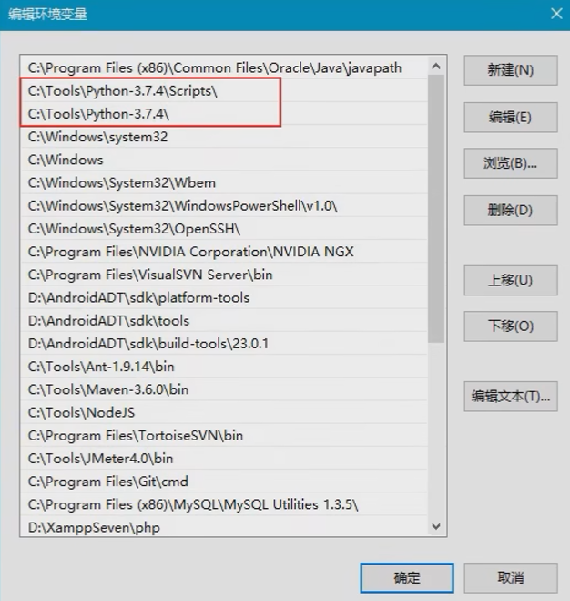

# python 安装与配置

## 一、学习目标

- 利用python 完成安全脚本开发

- 利用python 进行自动化运维、日志分析等

- 针对特定的服务器环境，用于开发安全测试工具

- 使用python进行安全基线检查

- 使用python进行资产收集、资产管理、信息采集

## 二、python特点

- 跨平台、可移植性强

- python由丰富的第三方库，开发效率高
- python的底层是C语言开发，整体运行效率较高
- python整体学习门槛不太高
- python 的开源项目、学习资源非常丰富

## 三、安装与配置

- 下载安装

- 配置环境

  

- 命令行输入“python -V”查看版本看是否安装完成

- 安装第三方库

  - pip在线安装 

  pip主要用于在线安装第三方库

  ```python
  pip install xxxx
  可以指定版本号： pip install xxx == 2.5.8
  
  可以配置国内镜像库：创建 c:\用户\登陆名\pip\pip.ini ，输入以下内容并重启cmd
  [global]
  index-url = 要替换的国内镜像的url
  [install]
  trusted-host=要替换的国内镜像的网址
  ```

  - 下载whl文件进行离线安装

    ```
    pip install xxxx.whl
    ```

  - 卸载库

    ```
    pip uninstall xxx
    ```