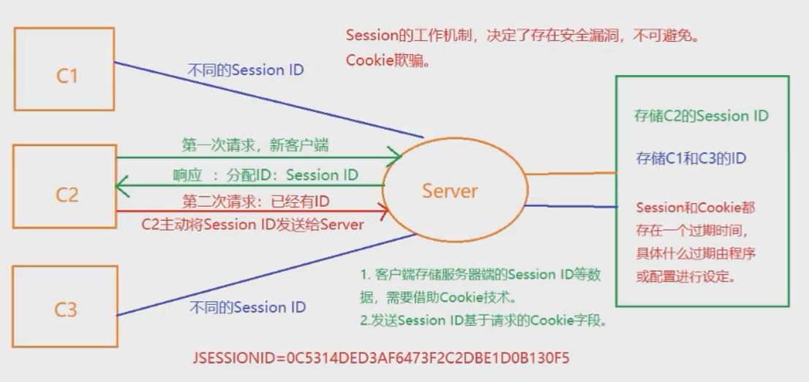

# Requests库处理HTTp

## 一、HTTP协议

### 1.请求类型

- GET：用于通过指定URL地址访问
- POST：URL地址+请求数据，将请求数据交给服务器
- PUT：与POST类似，主要用于Restful风格，用于更新数据
- DELETE：请求删除某个资源

### 2.响应类型

- 1XX：信息
- 2XX：正常
- 3XX：重定向
- 4XX：客户端错误
- 5XX：服务器端错误

### 3.Session/Cookie

- HTTP协议是无状态协议，利用Session和Cookie

- HTTP协议是单次通信，只有客户端发起请求，服务器端才会被动响应

  

### 4.其他

- HTTP协议簇包含：HTTP/HTTPS/Websocket（实现了基于HTTP协议的全双工通信）/HLS（音频、视频）/SOAP(Web service)
- HTTP协议属于应用层的文本型协议
- HTTP协议可以上传和下载任意类型的文件（传输二进制文件）
- HTTP协议在互联网上占比很大，原因：协议相对简单容易实现、有标准的Web服务器（Apache、Nginx、Tomcat、IIS等）

## 二、Requests库处理HTTP

- 发送GET请求

  ```python
  import requests
  resp = requests.get('键入URL')
  resp.encoding = 'utf-8'
  print(resp.text)
  ```

- 发送post请求

  ```python
  data = {'username':'admin','password':'admin123','verifycode':'0000'}
  resp = requests.post(url='键入URL',data=data)
  print(resp.text)                       # 输出正文
  print(resp.headers)                    # 输出头部信息
  ```

- 下载文件

  ```python
  resp = requests.get('http://XXXXX.com/img/banner_1.jpg')
  with open('./banner.jpg',mode='wb') as file:
      file.write(resp.content)
  ```

- 文件上传

  ```python
  # 要先登录，然后获取响应的Cookie，用于在后续请求中使用
  cookie = resp.cookies
  # 根据实际情况对参数做出改变
  file = {'batchfile':open('C:/XXXX/1.txt'),'rb'}
  data = {'batchname':'GB20200009'}
  reap = requests.post(url='键入URL'，data=data,files=file,cookies=cookie)
  print(resp.text)
  ```

  ```python
  # 第二种维持session的用法
  session = requests.session()
  data = {'username':'admin','password':'admin123','verifycode':'0000'}
  resp = session.post(url='键入URL',data=data)
  
  file = {'batchfile':open('C:/XXXX/1.txt'),'rb'}
  data = {'batchname':'GB20200009'}
  reap = session.post(url='键入URL'，data=data,files=file,cookies=cookie)
  print(resp.text)
  ```

- 利用python直接处理JSON

  ```python
  import json
  list = json.loads(resp.text)           # 将字符串反系列化为List+Dict的python对象
  print(list)
  ```

  