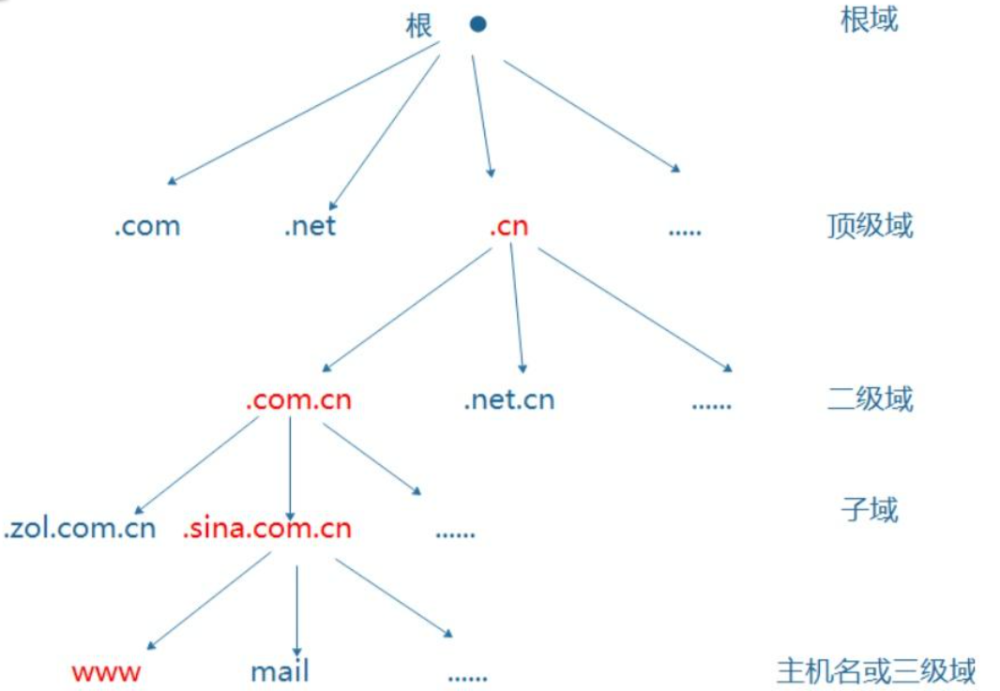

# 信息采集

## 一、子域名扫描

### 1.价值与分类

- 价值：在进行入侵之前，通常会考虑将周边的主机或应用进攻排查，进而从周边系统入手。通常情况下，主站的防御体系要更加完善，而周边站点可能会存在弱点。

- 分类：顶级域名、二级域名、三级域名

  

> 通常情况下，一个子域名的命名时相对规范的，爆破相对简单，而密码完全因人而异。

### 2.使用ping命令

- 使用ping命令可以获取域名对应的IP地址，则可以使用ping命令扫描
- 在Windows和Linux上ping命令的参数不太一样，所以如果扫描脚本运行于不同操作系统，需要做不同的参数处理

### 3.代码实现

```python
def ping_domain():
    with open('./dict.txt') as f:
        dimain_list = file.readlines()
        
    for domain in domain_list
    result = os.popen(f"ping -n 1 -w 1000 {domain.strip()}.baidu.com").read()
        
    if '找不到主机' not in result:
        print(f"{domain.strip()}.baidu.com")
```

### 4.使用socket库

```python
# 基于socket库的DNS解析功能实现扫描
def socket_domain():
    try:
    	ip = socket.gethostbyname('baidu.com')
    	print(f"{domain.strip()}.baidu.com,{ip}")
    except socket.gaierror:
        pass
```

### 5.域名扫描工具

- Windows工具：layer
- Linux工具：dnsenum

### 6.在线站点

- [在线子域名爆破 (zcjun.com)](http://z.zcjun.com/)

## 二、后台扫描

- 扫描一个网站的后台地址，通常不包含在页面的超链接中，或者无法通过爬虫获取到的一些隐藏的页面地址。
- 使用御剑后台扫描工具

## 三、Web站点信息采集

- kali工具：whatweb

- whois信息：查询某个域名的注册信息，在域名注册商查询

- python—whois库：以JSON形式返回

  ```python
  from whois import whois
  import json
  # 查询域名的whois信息
  def whois_info():
      result = whois('baidu.com')
      dict = json.loads(str(result))
  ```

- nslookup：根据域名获取其IP地址，用于确认域名是否使用了CDN网络

- [网络空间测绘，网络空间安全搜索引擎，网络空间搜索引擎，安全态势感知 - FOFA网络空间测绘系统](https://fofa.info/)：可用于端口和服务信息搜集，其好处是不用nmap直接扫描。

- [Shodan Search Engine](https://www.shodan.io/)：可以搜索一切联网的设备，如摄像头、工控设备、路由器、打印机等

